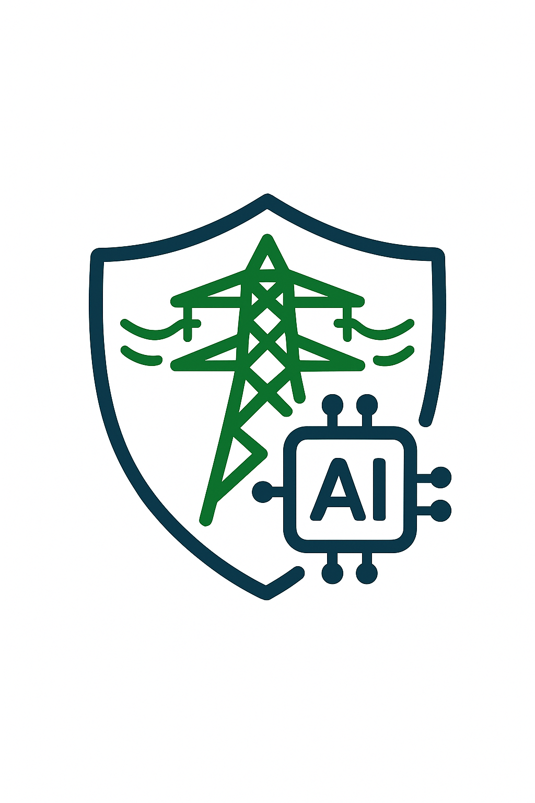

# CertifyEdge

[](https://opensource.org/licenses/Apache-2.0)

> **Formally-verified platform for certifying AI agents in power grid applications**

CertifyEdge provides end-to-end verification from STL specification authoring through Lean 4 compilation, SMT solving, certificate signing, and CI/CD gating with comprehensive auditing capabilities.

## Mission

Enable safe deployment of AI agents in critical power grid infrastructure through:

- **Formal Verification**: Mathematical proof of correctness using Lean 4
- **Audit Trail**: Complete provenance from specification to certificate
- **Compliance**: Built-in support for UL 2900-1, IEC 61850, and SOC 2
- **Security**: Defense-in-depth with mTLS, OPA policies, and cryptographic signatures
- **Performance**: High-throughput verification with GPU acceleration

<p align="center">
  
</p>

## Architecture

CertifyEdge follows a hexagonal architecture pattern with microservices:

```
┌─────────────────────────────────────────────────────────────────────────────┐
│                           CertifyEdge Platform                              │
├─────────────────────────────────────────────────────────────────────────────┤
│                                                                             │
│  ┌─────────────┐    ┌─────────────┐    ┌─────────────┐    ┌─────────────┐   │
│  │   Web UI    │    │  STL Editor │    │  Cert Mgmt  │    │   Auditor   │   │
│  │ (Next.js)   │    │ (TypeScript)│    │   (Rust)    │    │   (Rust)    │   │
│  └─────────────┘    └─────────────┘    └─────────────┘    └─────────────┘   │
│           │                   │                   │                   │     │
│           └───────────────────┼───────────────────┼───────────────────┘     │
│                               │                   │                         │
│  ┌─────────────┐    ┌───────────────┐    ┌─────────────┐    ┌─────────────┐ │
│  │ STL Compiler│    │Lean Autoprover│    │ SMT Verifier│    │ GPU Farm    │ │
│  │   (Rust)    │    │   (Lean 4)    │    │   (Rust)    │    │(K8s + GPU)  │ │
│  └─────────────┘    └───────────────┘    └─────────────┘    └─────────────┘ │
│           │                   │                   │                   │     │
│           └───────────────────┼───────────────────┼───────────────────┘     │
│                               │                   │                         │
│  ┌─────────────┐    ┌─────────────┐    ┌─────────────┐    ┌─────────────┐   │
│  │ Certificate │    │   Provenance│    │   Policy    │    │   Monitoring│   │
│  │   Service   │    │    Service  │    │   Engine    │    │ (Prometheus │   │
│  │   (Rust)    │    │   (Rust)    │    │   (OPA)     │    │   + Grafana)│   │
│  └─────────────┘    └─────────────┘    └─────────────┘    └─────────────┘   │
│                                                                             │
└─────────────────────────────────────────────────────────────────────────────┘
```

### Technology Stack

| Component | Technology | Purpose |
|-----------|------------|---------|
| **Core Services** | Rust + Tokio | High-performance microservices |
| **Web UI** | Next.js + TypeScript | Developer experience |
| **Formal Verification** | Lean 4 | Theorem proving |
| **SMT Solving** | Z3, CVC5 | Satisfiability modulo theories |
| **Container Runtime** | WebAssembly | Sandboxed execution |
| **Orchestration** | Kubernetes | Container orchestration |
| **Build System** | Bazel | Hermetic, reproducible builds |
| **Monitoring** | Prometheus + Grafana | Metrics and visualization |

## Quick Start

### Prerequisites

- Rust 1.75+ with Cargo
- Node.js 18+ with npm
- Docker and Kubernetes
- Lean 4 nightly
- Bazel 6.0+

### Development Setup

1. **Clone the repository**
   ```bash
   git clone https://github.com/fraware/CertifyEdge.git
   ```

2. **Install dependencies**
   ```bash
   # Install Rust dependencies
   cargo install cargo-audit cargo-tarpaulin
   
   # Install Node.js dependencies
   npm install
   
   # Install Lean 4
   curl -L https://raw.githubusercontent.com/leanprover/elan/master/elan-init.sh -sSf | sh
   elan default leanprover/lean4:nightly
   ```

3. **Build the project**
   ```bash
   # Build all targets
   bazel build //...
   
   # Run tests
   bazel test //...
   ```

4. **Start development environment**
   ```bash
   # Start local development
   bazel run //web:dev
   bazel run //services/certificate:dev
   ```

### Example Usage

```rust
// Create an STL specification
let spec = STLSpecification {
    name: "transformer_overload".to_string(),
    description: "Prevent transformer overload".to_string(),
    formula: STLFormula::Always(
        Box::new(STLFormula::Atomic(
            AtomicPredicate {
                variable: "transformer_load".to_string(),
                operator: ComparisonOperator::LessThan,
                threshold: 0.9,
            }
        ))
    ),
    author: "grid_operator@example.com".to_string(),
    ..Default::default()
};

// Compile to Lean 4
let lean_code = stl_compiler::compile(&spec)?;

// Verify with SMT solver
let verification_result = smt_verifier::verify(&lean_code)?;

// Generate certificate
let certificate = certificate_service::create_certificate(
    &spec,
    &verification_result,
    &model_hash
)?;
```

## Documentation

### Architecture

- [System Architecture & Threat Model](docs/architecture/001-system-architecture-threat-model.md)
- [Threat Model Details](docs/architecture/threat-model.md)
- [Architecture Overview](docs/architecture/README.md)

### Development

- [Contributing Guidelines](CONTRIBUTING.md)
- [Code of Conduct](CODE_OF_CONDUCT.md)
- [Security Policy](SECURITY.md)

### API Reference

- [REST API Documentation](docs/api/README.md)
- [gRPC API Reference](docs/api/grpc.md)
- [Certificate Format](docs/api/certificate.md)

## Security

CertifyEdge implements defense-in-depth security controls:

### Network Security
- mTLS for all inter-service communication
- Kubernetes network policies
- API gateway with rate limiting

### Application Security
- OPA policies for authorization
- Input validation and sanitization
- Static analysis and dependency scanning

### Cryptographic Security
- Ed25519 signatures for certificates
- Sigstore integration for transparency
- Hardware security modules (production)

### Compliance
- UL 2900-1: Software bill of materials
- IEC 61850: Grid communication security
- SOC 2 Type II: Access controls and monitoring

## Testing

### Quality Gates

| Metric | Target | Current |
|--------|--------|---------|
| Test Coverage | ≥ 95% | TBD |
| Security Scan | 0 HIGH | TBD |
| Build Time | < 10 min | TBD |
| API Latency | < 100ms P99 | TBD |

### Test Types

- **Unit Tests**: Component-level testing
- **Integration Tests**: Service interaction testing
- **Property Tests**: Formal property verification
- **Mutation Tests**: Code quality validation
- **Security Tests**: Vulnerability assessment
- **Performance Tests**: Load and stress testing

## Monitoring

### Metrics

- **Performance**: Response times, throughput, error rates
- **Security**: Authentication failures, suspicious activity
- **Business**: Certificate generation rate, verification success
- **Infrastructure**: Resource utilization, availability

### Alerting

- **Critical**: Certificate forgery attempts, security breaches
- **High**: Performance degradation, service failures
- **Medium**: Resource exhaustion, configuration drift
- **Low**: Informational events, maintenance windows

## Contributing

We welcome contributions! Please see our [Contributing Guidelines](CONTRIBUTING.md) for details.

### Development Workflow

1. Fork the repository
2. Create a feature branch
3. Make your changes
4. Add tests and documentation
5. Submit a pull request

### Code Quality

- Follow Rust and TypeScript style guides
- Maintain 95% test coverage
- Pass all security scans
- Include formal verification where applicable

## License

This project is licensed under the Apache License 2.0 - see the [LICENSE](LICENSE) file for details.

## Acknowledgments

- [Lean 4](https://leanprover.github.io/) for formal verification
- [Supabase](https://supabase.com/) for edge function patterns
- [Sigstore](https://sigstore.dev/) for cryptographic transparency
- [OWASP](https://owasp.org/) for security guidance

## Support

- **Issues**: [GitHub Issues](https://github.com/fraware/CertifyEdge/issues)
- **Discussions**: [GitHub Discussions](https://github.com/fraware/CertifyEdge/discussions)

---

**CertifyEdge**: Making AI safe for critical infrastructure through formal verification. 
