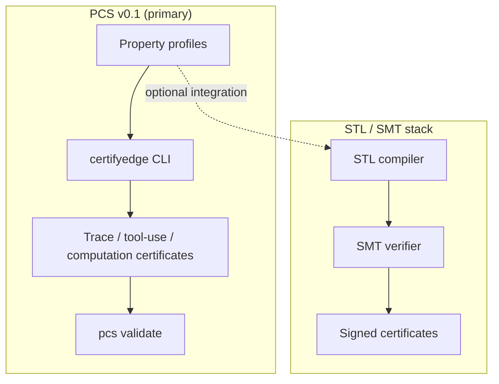

<div align="center">

# CertifyEdge

**Proof-carrying certificates and temporal property checking for scientific workflows**

[](LICENSE)
[](rust-toolchain.toml)

<br/>


<br/>

[Documentation](docs/README.md) · [Quick start](docs/quick-start.md) · [PCS guide](docs/pcs-guide.md) · [Contributing](CONTRIBUTING.md)

</div>

---

CertifyEdge is an open-source **Rust** toolkit for turning runtime evidence into **auditable, machine-validated certificates**. Its primary release path is [Proof-Carrying Science (PCS)](https://github.com/SentinelOps-CI/pcs-core) v0.1: profile-driven checks over LabTrust traces, agent tool-use logs, and computation receipts, with JSON artifacts downstream tools can verify using the `pcs` CLI.

The repository also includes an **STL/SMT specification stack** (parse temporal formulas, emit SMT-LIB and Lean-oriented output, run solvers, sign certificates) for power-grid and general temporal-logic workflows. The two stacks share the workspace and CI but serve different integration paths.

**Simulation disclaimer (PCS v0.1):** Hospital-lab certificates attest to [LabTrust-Gym](https://github.com/fraware/LabTrust-Gym) simulation traces only. They are not clinical or production laboratory guarantees.

---

## Get started in five minutes (PCS)

```bash
git clone https://github.com/fraware/CertifyEdge.git
cd CertifyEdge
cargo build -p certifyedge
make runbook
```

Full workflows, benchmarks, and release checks: **[docs/pcs-guide.md](docs/pcs-guide.md)**.

| Profile | Certificate type |
|---------|------------------|
| `hospital_lab.qc_release` | `TraceCertificate.v0` |
| `agent_tool_use.safety_v0` | `ToolUseCertificate.v0` |
| `scientific_computation.reproducibility_v0` | `ComputationWitness.v0` |

```bash
export CERTIFYEDGE_SOURCE_COMMIT="$(git rev-parse HEAD)"
make pcs-test                              # recommended before pull requests
make pcs-bench-producer-all-profiles       # all benchmark suites + ingest validation
```

Cross-repo demo (requires sibling [LabTrust-Gym](https://github.com/fraware/LabTrust-Gym) and the `pcs` CLI):

```bash
export PCS_DETERMINISTIC=1
make clean-checkout-certified
```

---

## What is in this repository


```mermaid
flowchart TB
  subgraph pcs["PCS v0.1 (primary)"]
    P[Property profiles] --> C[certifyedge CLI]
    C --> A[Trace / tool-use / computation certificates]
    A --> V[pcs validate]
  end
  subgraph stl["STL / SMT stack"]
    S[STL compiler] --> M[SMT verifier]
    M --> K[Signed certificates]
  end
  P -.->|optional integration| S
```

| Area | Location | Purpose |
|------|----------|---------|
| PCS CLI | `cli/`, `make runbook` | Emit and verify PCS certificates |
| Profiles | `templates/profiles/` | Map workflows to checks and artifact types |
| LabTrust adapter | `services/labtrust-adapter/` | Trace parsing, hashing, temporal checks |
| Certificate engine | `services/pcs-certificate/` | Emit, handoffs, benchmarks |
| STL compiler | `services/stl-compiler/` | Parse STL-style specs, emit prover artifacts |
| Schemas | `schemas/pcs/` | Vendored JSON schemas from pcs-core |
| Benchmarks | `benchmarks/certificates/` | Profile-driven certificate benchmark cases |

---

## Requirements

| Tool | Required for |
|------|----------------|
| Rust 1.88.0 ([`rust-toolchain.toml`](rust-toolchain.toml)) | All development |
| [pcs-core](https://github.com/SentinelOps-CI/pcs-core) (optional) | `pcs validate`, schema drift checks, benchmark ingest |
| [LabTrust-Gym](https://github.com/fraware/LabTrust-Gym) (optional) | Full cross-repo PCS chain |
| Bazelisk (optional) | Bazel targets matching CI |

---

## STL / SMT quick start

```bash
cargo check --workspace
cargo test -p integration_tests
bazel test --config=ci //tests/pipeline_integration:pipeline_integration
```

Library entry points: `stl_compiler::Compiler`, `smt_verifier::SMTVerifier`, `certificate::CertificateService`. Details: [docs/quick-start.md](docs/quick-start.md) and [services/stl-compiler/README.md](services/stl-compiler/README.md).

---

## Documentation

| Document | Audience |
|----------|----------|
| [docs/README.md](docs/README.md) | Documentation index |
| [docs/pcs-guide.md](docs/pcs-guide.md) | PCS users and integrators |
| [docs/quick-start.md](docs/quick-start.md) | Development environment setup |
| [docs/pcs-handoff.md](docs/pcs-handoff.md) | Cross-repository PCS chain |
| [CONTRIBUTING.md](CONTRIBUTING.md) | Contributors |
| [docs/adr/](docs/adr/) | Architecture decisions |

---

## Contributing

Contributions are welcome. Fork the repository, branch from `main`, run the checks in [CONTRIBUTING.md](CONTRIBUTING.md), and open a pull request.

---

## License

[Apache License 2.0](LICENSE)

---

<div align="center">

**Questions or feedback?** Open an [issue](https://github.com/fraware/CertifyEdge/issues) or [discussion](https://github.com/fraware/CertifyEdge/discussions) on GitHub.

</div>
