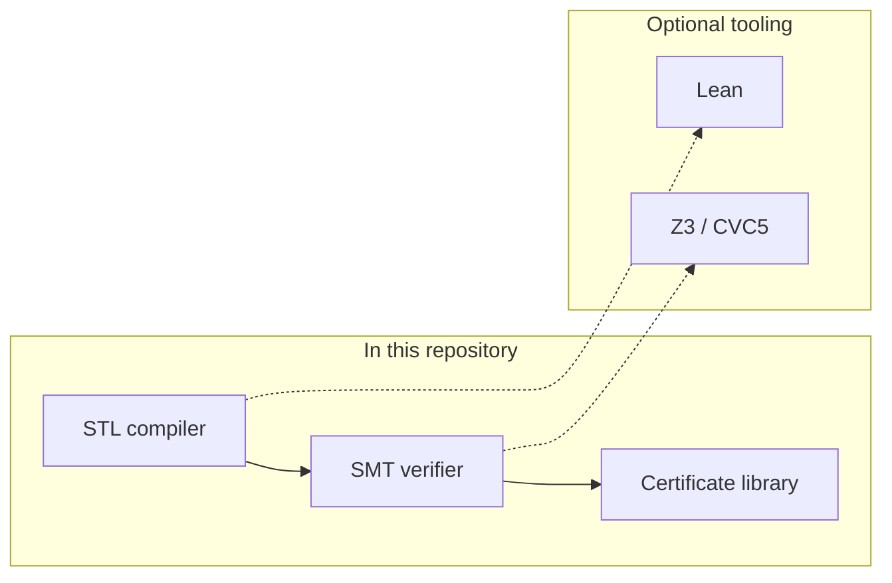

<div align="center">

# CertifyEdge

**Specifications, solvers, and signed artifacts for temporal properties**

[](LICENSE)
[](rust-toolchain.toml)

<br/>


<br/>

[Documentation](docs/README.md) · [Quick start](docs/quick-start.md) · [Contributing](CONTRIBUTING.md)

</div>

---

CertifyEdge is a **Rust** workspace for **signal temporal logic (STL)** specifications: parse and compile them, generate **SMT-LIB** and Lean-oriented output when configured, run **SMT** checks through a verifier service, and emit **Ed25519-signed certificates** that summarize what was checked. Power grids and AI agents are motivating domains; the code does not assume a specific industry.

---

## PCS v0.1 (LabTrust QC-release)

CertifyEdge v0.1 is the **temporal trace certification engine** for [Proof-Carrying Science](https://github.com/SentinelOps-CI/pcs-core) v0.1. It consumes LabTrust-Gym `trace.json`, checks hospital-lab temporal properties, and emits **TraceCertificate.v0** artifacts for Provability Fabric.

Runbook commands are implemented in the **`certifyedge`** binary (`cli/`). Search the repo for `emit-pcs-certificate`, `check-trace`, or constants like `CMD_EMIT_PCS_CERTIFICATE` in `cli/src/lib.rs`.

```bash
# Build the CLI (binary lands in target/debug/, not on PATH)
cargo build -p certifyedge

# Use `cargo run -p certifyedge -- <subcommand> ...` or ./target/debug/certifyedge.exe (Git Bash)
# Put on PATH without crates.io: ./scripts/install-certifyedge.sh
# See docs/pcs-trace-certificates.md if `cargo install` hits Windows SSL errors.

# Check a trace against the composite QC-release property
cargo run -p certifyedge -- check-trace \
  --spec templates/hospital_lab/qc_release.stl \
  --trace tests/labtrust/valid_trace.json

# Emit a PCS certificate
cargo run -p certifyedge -- emit-pcs-certificate \
  --spec templates/hospital_lab/qc_release.stl \
  --trace tests/labtrust/valid_trace.json \
  --out trace_certificate.json

# Verify certificate schema and digest
cargo run -p certifyedge -- verify-certificate trace_certificate.json \
  --trace tests/labtrust/valid_trace.json

# Explain a counterexample
cargo run -p certifyedge -- explain-counterexample counterexample.json
```

| Crate / path | Role |
|--------------|------|
| `services/labtrust-adapter/` | Parse LabTrust traces, hash chain, temporal checks |
| `services/pcs-certificate/` | `TraceCertificate.v0` export and digest |
| `cli/` | `certifyedge` command-line tool |
| `templates/hospital_lab/` | STL property specs (`qc_release`, etc.) |
| `tests/labtrust/` | Golden traces and expected outputs |

End-to-end flow with LabTrust-Gym and Provability Fabric is documented in [docs/pcs-trace-certificates.md](docs/pcs-trace-certificates.md), [docs/labtrust-adapter.md](docs/labtrust-adapter.md), and [docs/pcs-handoff.md](docs/pcs-handoff.md).

Quick runbook via Make: `make check-trace`, `make emit-certificate`, `make verify-certificate`, `make test`.

**Simulation disclaimer:** v0.1 certificates attest to LabTrust-Gym simulation traces only. They are not clinical or production laboratory guarantees.

---

## What you can do here

| | |
|:---|:---|
| **Author specs** | Text-based STL-style formulas, parameters, constraints, and metadata. |
| **Compile** | `stl_compiler` produces Lean and SMT-LIB artifacts from configuration. |
| **Verify** | `smt_verifier` runs scripts against solvers such as Z3 or CVC5 when enabled. |
| **Certify** | `certificate` builds and verifies signed certificate payloads. |
| **Automate** | The same flow is tested in CI with **Cargo** and **Bazel** so behavior stays honest. |

---

## Repository map


```mermaid
flowchart LR
  subgraph today["In this repository"]
    A[STL compiler] --> B[SMT verifier]
    B --> C[Certificate library]
  end
  subgraph optional["Optional tooling"]
    L[Lean]
    Z[Z3 / CVC5]
  end
  A -.-> L
  B -.-> Z
```

Broader platform pieces (web UI, full policy stack, production monitoring) are **partial** or **planned**; the diagram above is the spine that is exercised end-to-end in tests.

---

## Stack

| Layer | Choice | Note |
|------|--------|------|
| Language | Rust (async) | Workspace crates under `services/` |
| Proof / logic | Lean | Optional; toggled in compiler config |
| Solvers | Z3, CVC5 | Optional; paths and flags in config |
| Builds | Cargo + Bazel | Cargo for day-to-day iteration; Bazel matches CI |
| Protos | `protobuf` | Schema under `services/stl-compiler/proto/` |

---

## Quick start

**Requirements:** Rust toolchain from [`rust-toolchain.toml`](rust-toolchain.toml). Optional: [Bazelisk](https://github.com/bazelbuild/bazelisk) for Bazel ([`.bazelversion`](.bazelversion)).

```bash
git clone <URL from this repository’s GitHub page>
cd CertifyEdge

cargo check --workspace
cargo test --workspace
cargo test -p integration_tests
```

Bazel (same integration test as CI):

```bash
bazel test --config=ci //tests/pipeline_integration:pipeline_integration
```

**Primary APIs:** `stl_compiler::Compiler`, `smt_verifier::SMTVerifier`, `certificate::CertificateService`. A full walkthrough of flags and layout lives in [docs/quick-start.md](docs/quick-start.md); crate-level detail in [services/stl-compiler/README.md](services/stl-compiler/README.md).

---

## Documentation

| Resource | Description |
|----------|-------------|
| [docs/README.md](docs/README.md) | Index of guides and architecture decisions |
| [docs/quick-start.md](docs/quick-start.md) | Setup, commands, troubleshooting |
| [docs/adr/](docs/adr/) | Decision records (Bazel, CI, protos, security outline) |
| [CONTRIBUTING.md](CONTRIBUTING.md) | Pull requests, formatting, review expectations |

---

## Contributing

Contributions are welcome. Fork, branch from `main`, keep changes focused, run tests and `cargo fmt`, and open a pull request. See [CONTRIBUTING.md](CONTRIBUTING.md) for the full checklist.

---

## License

[Apache License 2.0](LICENSE)

---

## Acknowledgments

[Lean 4](https://leanprover.github.io/) · [Sigstore](https://sigstore.dev/) · [OWASP](https://owasp.org/)

---

<div align="center">

**Questions or ideas?** Use **Issues** and **Discussions** on this repository’s GitHub page.

<sub>CertifyEdge — temporal specifications, automated checking, and auditable certificates.</sub>

</div>
